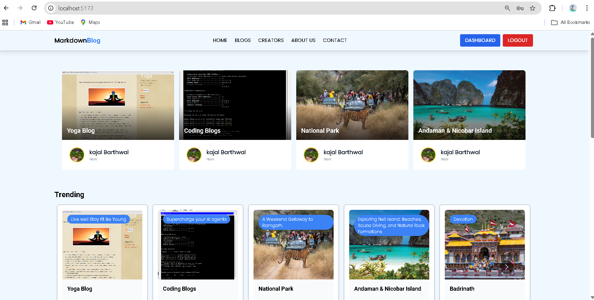
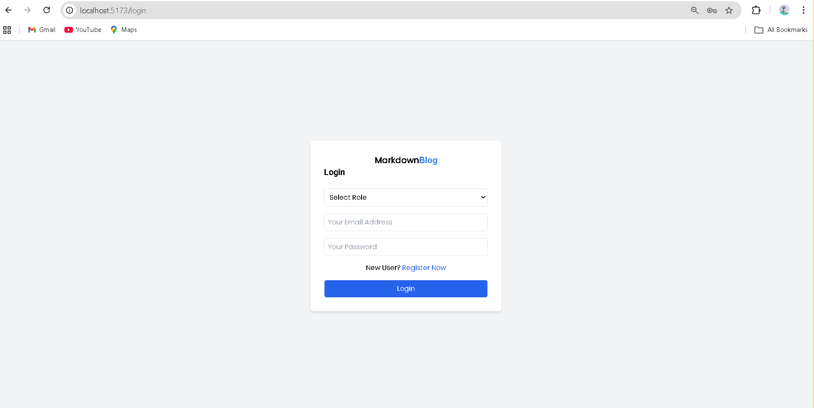
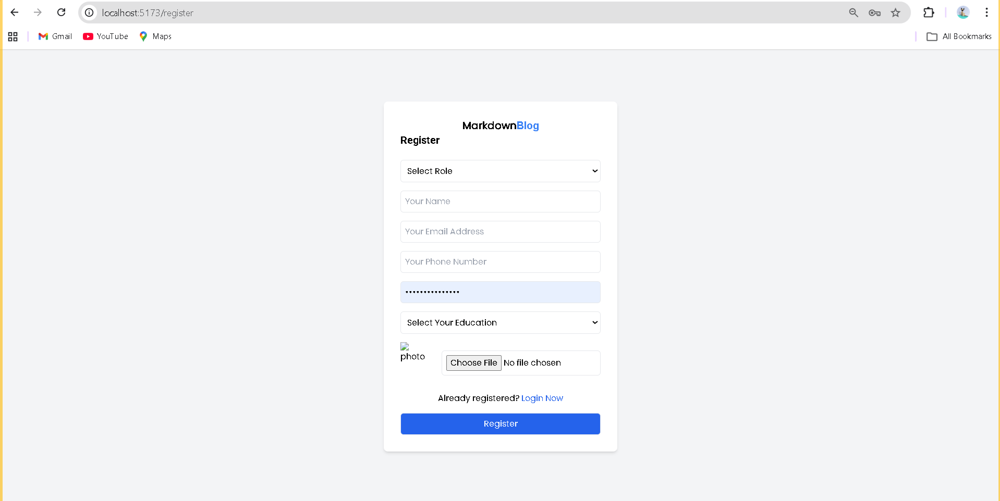
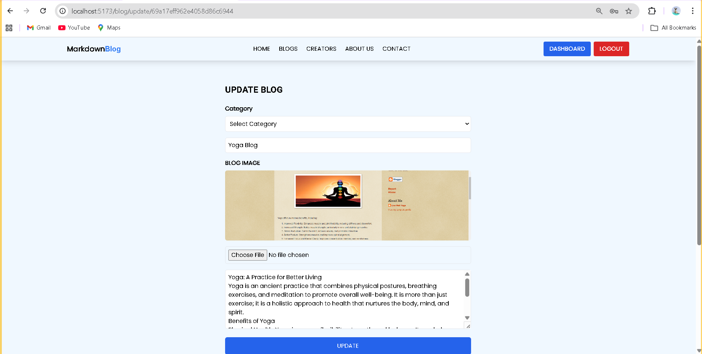
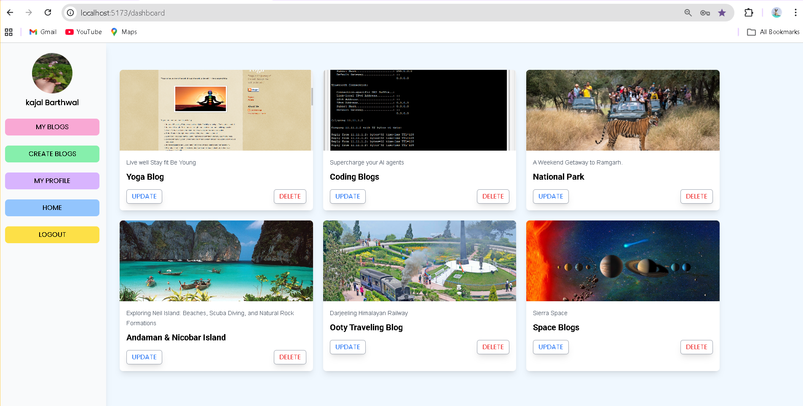
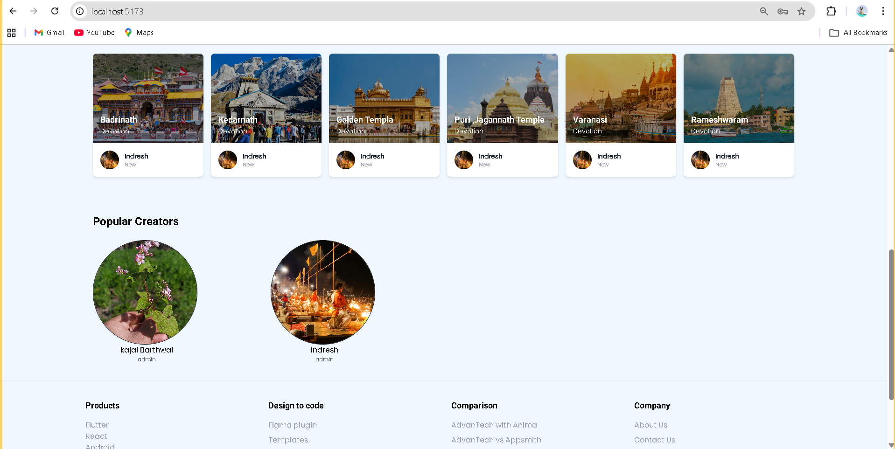
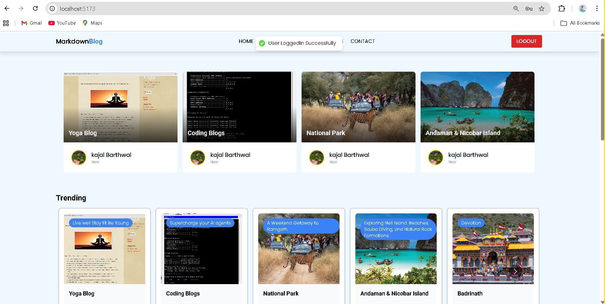
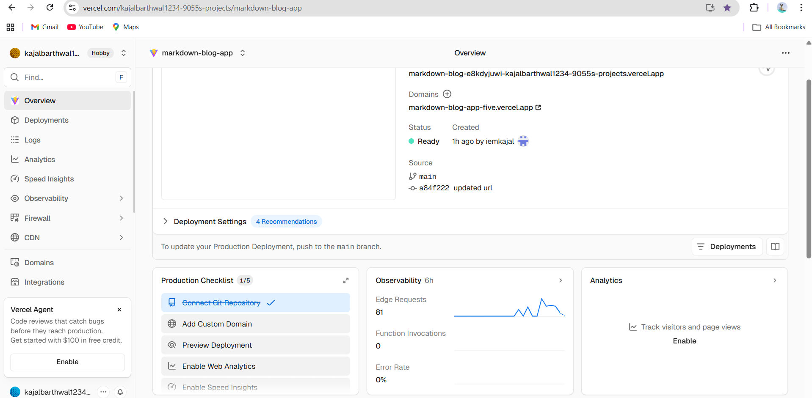
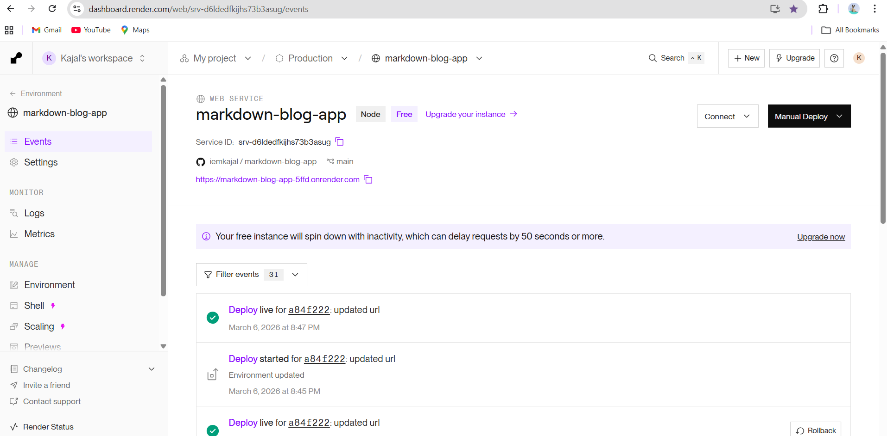

# Markdown Blog App (Full Stack)

A full-stack blogging platform where users can create, edit, and manage blog posts written in Markdown.
The application includes authentication, a personal dashboard, and a clean interface for writing and reading blogs.

Built using **React, Node.js, Express, and MongoDB** to demonstrate modern full-stack development practices.

---

# GitHub Repository

https://github.com/iemkajal/markdown-blog-app

---

# Tech Stack

## Frontend

* React
* Vite
* Tailwind CSS
* Context API

## Backend

* Node.js
* Express.js

## Database

* MongoDB

## Authentication

* JWT (JSON Web Token)

---

# Setup Instructions

Follow the steps below to run the project locally.

## 1. Clone the Repository

```bash
git clone https://github.com/iemkajal/markdown-blog-app.git
```

## 2. Navigate to the Project Folder

```bash
cd markdown-blog-app
```

---

# Backend Setup

Move to the backend folder and install dependencies:

```bash
cd backend
npm install
```

Create a `.env` file inside the backend folder and add:

```
MONGO_URI=your_mongodb_connection_string
JWT_SECRET=your_secret_key
```

Start the backend server:

```bash
npm start
```

Backend will run on:

http://localhost:5000

---

# Frontend Setup

Open a new terminal and run:

```bash
cd frontend
npm install
npm run dev
```

Frontend will run on:

http://localhost:5173

---

# Design Decisions

## Separation of Frontend and Backend

The application separates frontend and backend logic to maintain a clean architecture and allow easier scalability and maintenance.

## REST API Structure

The backend follows RESTful API principles to handle operations such as creating, updating, retrieving, and deleting blog posts.

## JWT Authentication

JWT tokens are used for secure user authentication and session management.

## Component Based Architecture

The frontend is built using reusable React components to maintain modular and maintainable code.

---

# Application Screenshots

## Homepage



## Login Page



## Register Page



## Blog Editor



## Dashboard



## Popular Creators



## Blog View



### Frontend Deployment (Vercel)


### Backend Deployment (Render)


---

# Author

Kajal Barthwal
MCA Graduate | Full Stack Developer